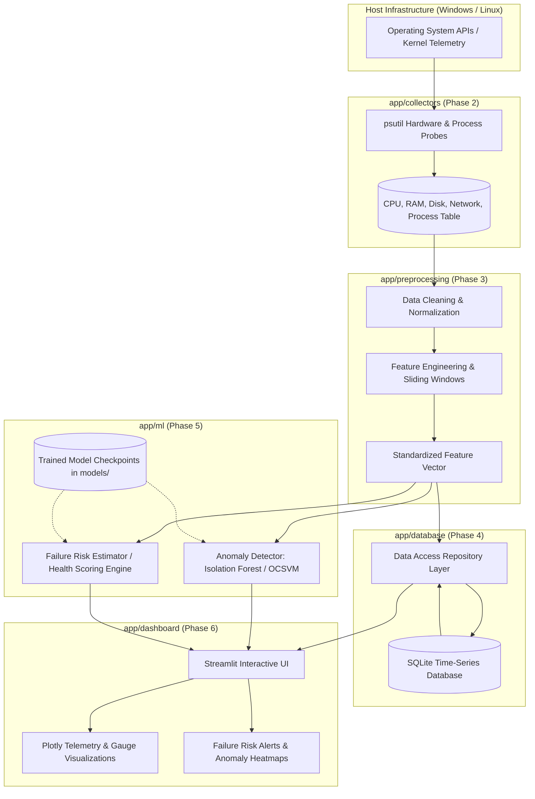

# System Architecture & Technical Design

## 1. Architectural Overview

The **AI-Based Predictive System Health Monitoring and Failure Risk Analysis** project is architected as a modular, decoupled, event-and-polling telemetry platform. It is engineered to monitor computing infrastructure (Windows initially, cross-platform extensible to Linux), extract system-level telemetry, preprocess operational signals, train and deploy unsupervised/supervised machine learning models, and present actionable risk intelligence through a real-time web dashboard.



---

## 2. Modular Layer Breakdown

The codebase enforces strict separation of concerns, isolating hardware I/O, mathematical transformations, algorithmic inference, persistent storage, and UI presentation into dedicated packages under `app/`.

### 2.1 Core Subsystem (`app/core/`) — *Implemented in Phase 1*
* **Responsibility**: Provides configuration parsing, environment management, and structured logging.
* **Key Components**:
  - `config.py`: Centralized immutable `Settings` dataclass providing typed paths via `pathlib.Path`, environment variable overrides with `.env` integration, validation rules, and directory bootstrap routines.
  - `logging_config.py`: Dual-destination logging framework (simultaneous console `stdout` and persistent file output in `logs/`) with timestamping, configurable log levels, and automatic prevention of duplicate handlers across repeated imports.

### 2.2 Telemetry Collectors (`app/collectors/`) & Data Models (`app/models/`) — *Implemented in Phase 2*
* **Responsibility**: Non-intrusive, low-overhead sampling of host metrics and structured, typed data encapsulation.
* **Implemented Components**:
  - `models/metrics.py`: Strongly typed, immutable dataclasses (`CPUMetrics`, `MemoryMetrics`, `DiskPartitionMetrics`, `DiskMetrics`, `NetworkMetrics`, `ProcessMetrics`, `SystemMetrics`) with helper properties, UTC timestamps, and `.to_dict()` serialization.
  - `collectors/base.py`: Generic abstract base class `BaseCollector[T]` defining standard `collect() -> T` contract and scoped logger access.
  - `collectors/cpu_collector.py`: Harvests overall CPU utilization %, logical/physical core counts, and per-core utilization % with non-blocking sampling initialization.
  - `collectors/memory_collector.py`: Harvests virtual memory total, available, used bytes, and utilization %.
  - `collectors/disk_collector.py`: Discovers accessible partition storage capacities and usage, handles Windows drive letters, skips inaccessible volumes gracefully, and aggregates total disk storage.
  - `collectors/network_collector.py`: Tracks cumulative network I/O counters and computes instantaneous upload/download throughput (bytes/sec) using monotonic elapsed time deltas and counter reset guards.
  - `collectors/process_collector.py`: Enumerates top host processes sorted by CPU and memory utilization, filtering to `max_processes`, and safely handling `NoSuchProcess`, `AccessDenied`, and `ZombieProcess`.
  - `collectors/system_collector.py`: Central coordinator orchestrating all collectors with isolated failure boundaries, returning unified `SystemMetrics` and managing periodic loops with clean shutdown.
* **Separation Boundary**: Collectors only read from `psutil` or OS APIs and return raw, typed dataclasses. They contain zero ML or visualization logic.

### 2.3 Preprocessing & Feature Engineering (`app/preprocessing/`) — *Implemented in Phase 3*
* **Responsibility**: Validate, sanitize, and transform raw multi-domain metrics into clean, structured numerical feature vectors suitable for future machine learning and historical persistence.
* **Implemented Components**:
  - `validator.py`: `MetricsValidator` and `ValidationResult` inspecting raw `SystemMetrics` snapshots for missing, out-of-range, and non-finite values (NaN/inf) without halting the collection loop.
  - `cleaner.py`: `MetricsCleaner` and `CleanedSystemMetrics` providing safe imputation (zero-fill, last-valid), boundary clamping ([0.0, 100.0] for percentages), and domain quality indicators (`is_cpu_missing`, `is_memory_missing`, etc.) with log deduplication.
  - `rolling.py`: `RollingWindowBuffer` providing a bounded circular buffer (`deque`) tracking historical samples up to `max_history_size` and computing moving window statistics (mean, max, min) and step deltas over `rolling_window_size` samples. Detects and recovers from timestamp regressions and large sampling gaps.
  - `feature_engineer.py`: `FeatureEngineer` and `FeatureVector` computing 39 continuous numerical features across CPU, Memory, Disk, Network, Process table summaries, temporal signals (sample interval, hour of day, day of week), and quality indicators.
  - `pipeline.py`: `PreprocessingPipeline` orchestrating validation, cleaning, rolling buffer tracking, and feature extraction into a cohesive `ProcessedTelemetry` container.
* **Separation Boundary**: Preprocessing produces clean numerical arrays or dictionary-backed `FeatureVector` instances ready for either the database repository or future ML models. It does not train ML models or write directly to databases.

### 2.4 Database Persistence (`app/database/`) — *Implemented in Phase 4*
* **Responsibility**: Lightweight, robust, self-contained time-series telemetry persistence and historical data access using SQLite.
* **Implemented Components**:
  - `connection.py`: Reliable SQLite connection lifecycle management, WAL mode activation (`PRAGMA journal_mode = WAL;`), foreign key enforcement (`PRAGMA foreign_keys = ON;`), busy lock timeouts (`PRAGMA busy_timeout`), and atomic transactional context managers (`transaction_scope`, `db_session`) with rollback protection.
  - `schema.py`: Normalized relational schema definitions, column constants, and index declarations for `system_metrics`, `feature_vectors` (featuring all 39 distinct numerical features stored as typed `REAL` columns alongside JSON backups), `validation_logs`, and `schema_migrations`.
  - `migrations.py`: Idempotent schema initialization and version tracking ensuring safe upgrades without data loss across restarts.
  - `models.py`: Typed record dataclasses (`SystemMetricRecord`, `FeatureVectorRecord`, `ValidationLogRecord`, `PersistenceResult`) converting raw database rows into Python objects with UTC timestamps.
  - `repository.py`: Parameterized data access layer (`MetricsRepository`) providing CRUD operations, ID lookups, latest-record retrieval, chronological time-range queries, whitelist-protected record counting, and retention cleanup.
  - `service.py`: High-level persistence coordinator (`PersistenceService`) that coordinates atomic multi-table inserts (linking raw metrics, 39-feature vectors, and validation logs via foreign keys within a single transactional boundary), handles errors gracefully without crashing the collection loop, and executes retention purges.
* **Separation Boundary**: Fully abstracts all SQL DDL/DML behind typed repository and service interfaces. Collectors, feature pipelines, and ML components never construct raw SQL queries.

### 2.5 Machine Learning & Failure Risk Analysis (`app/ml/`) — *Implemented in Phase 5*
* **Responsibility**: Detect unusual host behavior using unsupervised machine learning, compute deterministic operational health scores, assign risk tiers, and provide an extensible interface for future supervised failure classification.
* **Implemented Components**:
  - `models.py`: Strongly typed dataclasses and enums (`RiskCategory`, `AnomalyResult`, `HealthScoreResult`, `PredictionResult`, `ModelMetadata`).
  - `feature_schema.py`: Canonical 39-feature ordering and schema enforcement (`EXPECTED_FEATURE_COUNT = 39`), non-finite value validation (NaN/inf check), and vector-to-matrix transformations.
  - `data_loader.py`: `FeatureDataLoader` querying historical feature vectors from SQLite via `PersistenceService` with minimum sample thresholds (`ml_min_training_samples`) and graceful empty-state handling.
  - `anomaly_detector.py`: `IsolationForestDetector` wrapping `sklearn.ensemble.IsolationForest` with deterministic random seed, configurable estimators/contamination, and calibrated anomaly probability scoring in $[0.0, 1.0]$ via centered logistic transform.
  - `health_score.py`: `HealthScoreCalculator` executing deterministic composite scoring in $[0.0, 100.0]$ with up to 60-point anomaly penalties and up to 40-point resource stress penalties (CPU $>80\%$, RAM $>85\%$, Disk $>90\%$).
  - `risk_analyzer.py`: `RiskAnalyzer` producing 5 discrete risk categories (`Normal`, `Low`, `Moderate`, `High`, `Critical`), supporting configurable thresholds, explanations, and hardware saturation overrides ($\ge 95\%$).
  - `model_manager.py`: `ModelManager` orchestrating atomic artifact serialization (`joblib`), companion JSON metadata recording, and strict schema-drift validation during model loading.
  - `supervised.py`: `BaseFailureClassifier` and `SupervisedFailureClassifier` extension points documenting true failure prediction prerequisites without inventing fabricated failure labels.
  - `prediction_service.py`: `PredictionService` coordinating inference, health scoring, risk analysis, model hot-reloading, and heuristic fallback when no model is trained.
  - `training.py`: `ModelTrainer` end-to-end training orchestrator and CLI runner.
* **Separation Boundary**: ML components accept standardized `FeatureVector` or NumPy arrays and return structured `PredictionResult` objects. They do not query OS telemetry directly or access raw tables bypassing `PersistenceService`.

### 2.6 Dashboard & Presentation (`app/dashboard/`) — *Implemented in Phase 6*
* **Responsibility**: Interactive web visualization, system health telemetry monitoring, anomaly auditing, and database inspection using Streamlit and Plotly.
* **Architecture & Components**:
  - `dashboard_main.py`: Streamlit entry point orchestrating 6 comprehensive views: System Overview, Health & Risk Analysis, Real-Time Monitoring, Historical Telemetry, Anomaly Audit Log, and Database Inspection.
  - `services/dashboard_service.py`: High-level coordination layer decoupling the web UI from direct database and ML layers; provides thread-safe background monitoring controls with `threading.Event`, live telemetry snapshots, historical query bounds, and safe fallback handling.
  - `charts/builders.py`: Modular Plotly chart builders generating interactive gauges (Health Score 0–100, Anomaly Probability 0.0–1.0), resource breakdown bars with threshold reference lines, dual-axis multi-metric time-series graphs, and risk-categorized anomaly scatter charts.
  - `components/`: Reusable Streamlit UI widgets including `status_header.py` (system state banner), `metrics_cards.py` (CPU/RAM/Disk/Network/Process metrics with warning thresholds), and `health_card.py` (gauge visualizers, risk tier matrix, heuristic fallback notices, and academic disclaimers).
  - `utils/formatting.py`: Human-readable formatters for byte counts, network throughput, percentages, ISO/local timestamps, and risk severity badges.
* **Separation Boundary**: Operates as a decoupled presentation layer communicating exclusively via `DashboardService`. Ensures thread safety with dedicated worker locks and never starts competing collectors upon Streamlit script reruns.

### 2.7 Cross-Cutting Utilities (`app/utils/`)
* **Responsibility**: Platform detection, time-zone formatting, and general helper routines shared across modules without circular dependencies.

---

## 3. Telemetry & Data Flow Pipeline

The end-to-end operational cycle follows a linear, deterministic pipeline:

```text
[Hardware Sensors / OS Kernel]
               │ (Sampling Interval: 5.0s default)
               ▼
      [psutil Collectors]
      (CPU, Memory, Disk, Network, Process)
               │ Unified SystemMetrics Snapshot (UTC)
               ▼
    [Preprocessing & Feature Pipeline]
    ├── 1. MetricsValidator (Range & NaN/Inf Checks)
    ├── 2. MetricsCleaner (Imputation & Boundary Clamping)
    ├── 3. RollingWindowBuffer (Bounded Deque, Moving Stats)
    └── 4. FeatureEngineer (39 Numerical Features)
               │ Standardized FeatureVector & ProcessedTelemetry
       ┌───────┴───────────────────┐
       ▼                           ▼
[SQLite Storage]           [ML Prediction Service]
├── system_metrics          ├── IsolationForestDetector (Calibrated Score 0.0 - 1.0)
├── feature_vectors         ├── HealthScoreCalculator (Composite Score 0 - 100)
└── validation_logs         └── RiskAnalyzer (Normal / Low / Moderate / High / Critical)
(Phase 4 - COMPLETED)       (Phase 5 - COMPLETED)
       │                           │
       └──────────────┬────────────┘
                      ▼
            [Streamlit Dashboard]
            (Plotly Gauges & Charts)
            (Phase 6 - COMPLETED)
```

1. **Sampling Cycle**: The scheduler (`SystemCollector.run_collection_loop`) triggers metric collectors according to `METRIC_COLLECTION_INTERVAL` (configured in `Settings`).
2. **Failure Isolation**: Sub-collectors run independently; if an individual hardware probe encounters an OS exception, the error is isolated in `SystemMetrics.errors` without halting other collectors.
3. **Validation & Cleaning**: `MetricsValidator` inspects values for operational limits, and `MetricsCleaner` safely imputes missing data while setting indicator flags (`is_cpu_missing`, etc.) and clamping percentages.
4. **Rolling Feature Generation**: `RollingWindowBuffer` tracks a bounded history (`max_history_size`) and computes rolling statistics (mean, max, min) and sample deltas over `rolling_window_size` observations, generating a clean `FeatureVector`.
5. **Atomic Data Persistence**: `PersistenceService` commits the sample across `system_metrics`, `feature_vectors`, and `validation_logs` in an atomic transaction linked via foreign keys.
6. **ML Inference**: `PredictionService` evaluates the current 39-feature vector, generating an anomaly score, health score, and risk tier without degrading the collection loop.
7. **Presentation (Phase 6)**: The Streamlit user interface refreshes dynamically, updating live Plotly gauges and alerting operators to elevated failure risk without starting competing background collection threads.

---

## 4. Cross-Platform Extensibility Strategy

* **Filesystem & Pathing**: All filesystem references use Python's `pathlib.Path` to prevent OS-specific delimiter issues (`/` vs `\`).
* **OS-Specific Metrics**: The collectors interface uses platform-neutral abstractions via `psutil`, enabling native Windows WMI/Performance Counter additions alongside Linux `/proc` and `/sys` integrations in future phases.

---

## 5. Development Phases and Roadmap

| Phase | Milestone Name | Status | Deliverables |
| :--- | :--- | :--- | :--- |
| **Phase 1** | **Project Foundation & Architecture** | **COMPLETED** | Modular directory layout, configuration system, structured logging, entry points, unit tests, architecture specification. |
| **Phase 2** | **Metric Collection Engine** | **COMPLETED** | `psutil` collectors for CPU, Memory, Disk, Network, and Process health; typed metric data models; failure isolation; periodic sampling loop; unit & integration tests. |
| **Phase 3** | **Data Preprocessing & Feature Engineering** | **COMPLETED** | Telemetry validator, data cleaner with imputation strategies, bounded rolling window buffer, 39 engineered features, end-to-end preprocessing pipeline, unit & integration tests. |
| **Phase 4** | **SQLite Data Persistence** | **COMPLETED** | SQLite connection manager (WAL mode, FKs), versioned schema migrations, normalized tables for raw metrics, 39-feature vectors, and validation logs, atomic transactions, retention cleanup, full test suite (94 passing tests). |
| **Phase 5** | **Machine Learning & Failure Risk Engine** | **COMPLETED** | Historical SQLite data loader, Isolation Forest anomaly detector, logistic score calibration, deterministic 0–100 health scoring, multi-tier risk analyzer, atomic model persistence, supervised failure classification extension point, 48 ML unit/integration tests (143 total passing tests). |
| **Phase 6** | **Interactive Web Dashboard** | **COMPLETED** | Streamlit web application, modular components and chart builders, thread-safe monitoring lifecycle, live Plotly gauges, historical telemetry and anomaly audit views, database inspector, 18 new unit & integration tests (161 total passing tests). |
| **Phase 7** | Linux Extensibility & Deployment | *Planned* | Cross-platform validation, daemon/service packaging, integration testing. |


